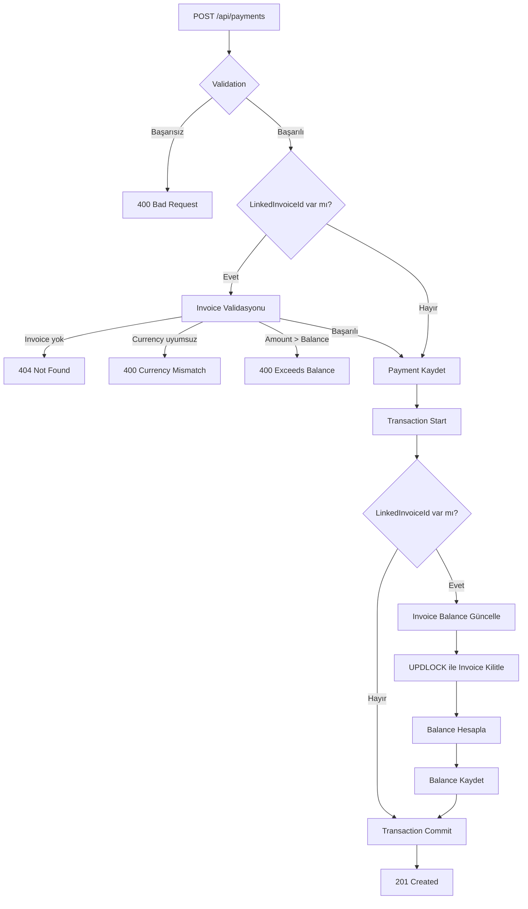

# Payment (Ödeme) İş Akışları

**Versiyon:** 1.0  
**Tarih:** 3 Ocak 2025  
**Proje:** Accounting ERP System

---

## 📋 İçindekiler

1. [Genel Bakış](#genel-bakış)
2. [Payment Tipleri](#payment-tipleri)
3. [Payment Oluşturma Akışı](#payment-oluşturma-akışı)
4. [Faturaya Bağlı Payment Akışı](#faturaya-bağlı-payment-akışı)
5. [Payment Güncelleme ve Silme](#payment-güncelleme-ve-silme)
6. [Invoice Balance Hesaplama](#invoice-balance-hesaplama)
7. [Validasyon Kuralları](#validasyon-kuralları)
8. [Concurrency (Eşzamanlılık) Yönetimi](#concurrency-yönetimi)
9. [Hata Senaryoları](#hata-senaryoları)
10. [API Örnekleri](#api-örnekleri)

---

## Genel Bakış

Payment (Ödeme) modülü, şirketin nakit giriş-çıkışlarını yöneten temel modüldür. İki ana kategoride çalışır:

### 1. Faturaya Bağlı Ödemeler (Linked Payments)
- Müşteri faturalarına yapılan ödemeler
- Tedarikçi faturalarının ödenmesi
- Invoice balance'ı otomatik günceller
- Ödeme planları ve taksitler

### 2. Faturasız Ödemeler (Unlinked Payments)
- Avans ödemeleri
- Genel gider ödemeleri
- Maaş ödemeleri
- Diğer nakit hareketleri

---

## Payment Tipleri

### Direction (Yön)

```csharp
public enum PaymentDirection
{
    In,   // Gelen ödeme (müşteriden)
    Out   // Giden ödeme (tedarikçiye, personele)
}
```

### Örnekler

| Senaryo | Direction | LinkedInvoiceId | Açıklama |
|---------|-----------|-----------------|----------|
| Müşteri fatura ödemesi | `In` | Dolu | Satış faturasına tahsilat |
| Tedarikçi fatura ödemesi | `Out` | Dolu | Alış faturasına ödeme |
| Müşteri avansı | `In` | `null` | Gelecek siparişler için |
| Maaş ödemesi | `Out` | `null` | Personel maaşı |
| Genel gider | `Out` | `null` | Kira, elektrik vb. |

---

## Payment Oluşturma Akışı

### Akış Diyagramı



### Adım Adım Açıklama

#### 1. Request Alınır
```http
POST /api/payments
Content-Type: application/json

{
  "branchId": 1,
  "accountId": 5,
  "contactId": 12,
  "linkedInvoiceId": 100,
  "direction": "In",
  "amount": "500.00",
  "currency": "TRY",
  "dateUtc": "2025-01-03T10:00:00Z"
}
```

#### 2. Validasyon (CreatePaymentValidator)
```csharp
// Temel validasyonlar
- BranchId > 0
- AccountId > 0
- Direction geçerli enum
- Currency: 3 harfli, büyük harf (TRY, USD, EUR, GBP)
- Amount: Geçerli decimal, > 0
- DateUtc: Geçerli UTC tarih

// LinkedInvoiceId validasyonları (eğer dolu ise)
- Invoice var mı ve silinmemiş mi?
- Currency eşleşiyor mu?
- Amount <= Invoice.Balance mı?
```

#### 3. Handler Çalışır (CreatePaymentHandler)
```csharp
public async Task<CreatePaymentResult> Handle(CreatePaymentCommand req, CancellationToken ct)
{
    // 1. Entity oluştur
    var entity = new Payment
    {
        BranchId = req.BranchId,
        AccountId = req.AccountId,
        ContactId = req.ContactId,
        LinkedInvoiceId = req.LinkedInvoiceId,
        Direction = req.Direction,
        Amount = Money.P2(req.Amount),
        Currency = req.Currency.ToUpperInvariant(),
        DateUtc = DateTime.Parse(req.DateUtc, ...).ToUniversalTime(),
        CreatedAtUtc = DateTime.UtcNow
    };

    // 2. EF tracking'e ekle
    _db.Payments.Add(entity);

    // 3. Invoice balance güncelle (eğer linked ise)
    if (entity.LinkedInvoiceId.HasValue)
    {
        await _balanceService.RecalculateBalanceAsync(
            entity.LinkedInvoiceId.Value, ct);
    }

    // 4. Kaydet (Transaction)
    await _db.SaveChangesAsync(ct);

    return new CreatePaymentResult { Id = entity.Id };
}
```

#### 4. Invoice Balance Güncelleme (Eğer Linked ise)
```csharp
public async Task<decimal> RecalculateBalanceAsync(int invoiceId, CancellationToken ct)
{
    // 1. Invoice'u KİLİTLE (UPDLOCK + HOLDLOCK)
    var invoice = await _db.QueryRaw<Invoice>($@"
        SELECT * FROM Invoices WITH (UPDLOCK, HOLDLOCK)
        WHERE Id = {invoiceId}
    ").FirstOrDefaultAsync(ct);

    // 2. Toplam ödemeleri hesapla (tracking kullan, Add'i gör)
    var totalPayments = await _db.Payments
        .Where(p => p.LinkedInvoiceId == invoiceId && !p.IsDeleted)
        .SumAsync(p => (decimal?)p.Amount, ct) ?? 0m;

    // 3. Balance hesapla ve güncelle
    var balance = Money.R2(invoice.TotalGross - totalPayments);
    invoice.Balance = balance;

    // 4. SaveChanges caller tarafından yapılacak
    return balance;
}
```

#### 5. Transaction Commit
```csharp
// TransactionBehavior (Pipeline)
await using var transaction = await _db.BeginTransactionAsync(ct);
try
{
    var result = await next();  // Handler çalışır
    await transaction.CommitAsync(ct);
    return result;
}
catch
{
    await transaction.RollbackAsync(ct);
    throw;
}
```

---

## Faturaya Bağlı Payment Akışı

### Senaryo: Müşteri Faturasına Kısmi Ödeme

**Başlangıç Durumu:**
```
Invoice #100:
- Type: Sales
- TotalGross: 1,000.00 TRY
- Balance: 1,000.00 TRY (henüz ödeme yok)
```

**1. Birinci Ödeme:**
```http
POST /api/payments
{
  "linkedInvoiceId": 100,
  "amount": "300.00",
  "currency": "TRY",
  "direction": "In"
}
```

**Sonuç:**
```
Payment #1 oluşturuldu
Invoice #100:
- Balance: 700.00 TRY (1000 - 300)
```

**2. İkinci Ödeme:**
```http
POST /api/payments
{
  "linkedInvoiceId": 100,
  "amount": "500.00",
  "currency": "TRY",
  "direction": "In"
}
```

**Sonuç:**
```
Payment #2 oluşturuldu
Invoice #100:
- Balance: 200.00 TRY (1000 - 300 - 500)
```

**3. Fazla Ödeme Denemesi:**
```http
POST /api/payments
{
  "linkedInvoiceId": 100,
  "amount": "300.00",  // Balance'dan fazla!
  "currency": "TRY",
  "direction": "In"
}
```

**Hata:**
```json
{
  "type": "https://tools.ietf.org/html/rfc7231#section-6.5.1",
  "title": "One or more validation errors occurred.",
  "status": 400,
  "errors": {
    "CreatePaymentCommand": [
      "Payment amount exceeds invoice balance. Remaining balance: 200.00 TRY"
    ]
  }
}
```

---

## Payment Güncelleme ve Silme

### Soft Delete (SoftDeletePaymentHandler)

```csharp
public async Task<Unit> Handle(SoftDeletePaymentCommand req, CancellationToken ct)
{
    // 1. Payment bul
    var entity = await _db.Payments.FindAsync(req.Id);
    if (entity == null || entity.IsDeleted)
        throw new NotFoundException("Payment", req.Id);

    // 2. Soft delete işaretle
    entity.IsDeleted = true;
    entity.DeletedAtUtc = DateTime.UtcNow;

    // 3. Invoice balance güncelle (eğer linked ise)
    if (entity.LinkedInvoiceId.HasValue)
    {
        await _balanceService.RecalculateBalanceAsync(
            entity.LinkedInvoiceId.Value, ct);
    }

    // 4. Kaydet
    await _db.SaveChangesAsync(ct);
    return Unit.Value;
}
```

### Örnek Senaryo

**Başlangıç:**
```
Invoice #100: Balance = 200.00 TRY
Payment #1: 300.00 TRY (silinmemiş)
Payment #2: 500.00 TRY (silinmemiş)
```

**Silme İşlemi:**
```http
DELETE /api/payments/1
```

**Sonuç:**
```
Payment #1: IsDeleted = true
Invoice #100: Balance = 700.00 TRY (1000 - 500)
```

**Açıklama:**
- Payment #1 soft delete edildi (500 TL)
- Balance yeniden hesaplandı: 1000 - 300 (silinmiş, sayılmaz) - 500 = 500 TL değil!
- Doğru hesaplama: 1000 - 500 = 500 TL
- **YANLIŞ!** Balance 700 olmalı (sadece Payment #2 sayılır)

**Düzeltme:**
```
Invoice #100: Balance = 700.00 TRY
- TotalGross: 1000.00
- Payment #1: Silinmiş (sayılmaz)
- Payment #2: 500.00
- Balance = 1000 - 500 = 500.00 TRY
```

**TEKRAR DÜZELTME (doğrusu):**
Eğer Payment #1 = 300 TRY silindiyse:
```
Balance = 1000 - 500 (sadece Payment #2) = 500 TRY
```

Ama örneğimizde önceki balance 200 TRY idi:
```
1000 - 300 - 500 = 200 TRY
```

Payment #1 (300 TRY) silininince:
```
1000 - 500 = 500 TRY
```

Balance 200'den 500'e çıktı (+300) ✅ DOĞRU!

---

## Invoice Balance Hesaplama

### Formül

```
Balance = TotalGross - SUM(Payments WHERE LinkedInvoiceId = Invoice.Id AND IsDeleted = false)
```

### Örnek Hesaplama

```sql
-- Invoice #100
SELECT 
    i.Id,
    i.TotalGross,
    ISNULL(SUM(p.Amount), 0) AS TotalPayments,
    i.TotalGross - ISNULL(SUM(p.Amount), 0) AS CalculatedBalance,
    i.Balance AS StoredBalance
FROM Invoices i
LEFT JOIN Payments p ON p.LinkedInvoiceId = i.Id AND p.IsDeleted = 0
WHERE i.Id = 100
GROUP BY i.Id, i.TotalGross, i.Balance;
```

**Sonuç:**
```
Id  TotalGross  TotalPayments  CalculatedBalance  StoredBalance
100 1000.00     800.00         200.00             200.00
```

### Balance Güncellenme Zamanları

| Olay | Handler | Balance Güncellenir mi? |
|------|---------|------------------------|
| Invoice oluşturma | CreateInvoiceHandler | ✅ Evet (TotalGross olarak) |
| Invoice güncelleme | UpdateInvoiceHandler | ✅ Evet (TotalGross değiştiyse) |
| Payment oluşturma | CreatePaymentHandler | ✅ Evet (linked ise) |
| Payment silme | SoftDeletePaymentHandler | ✅ Evet (linked ise) |
| Payment güncelleme | - | ❌ Yok (şu anda update yok) |

---

## Validasyon Kuralları

### Temel Validasyonlar

```csharp
RuleFor(x => x.BranchId).GreaterThan(0);
RuleFor(x => x.AccountId).GreaterThan(0);
RuleFor(x => x.Direction).IsInEnum();
RuleFor(x => x.Currency).MustBeValidCurrency();
RuleFor(x => x.Amount).MustBeValidMoneyAmount();
RuleFor(x => x.DateUtc).MustBeValidUtcDateTime();
```

### Invoice-Specific Validasyonlar (LinkedInvoiceId varsa)

#### 1. Invoice Existence Check

```csharp
RuleFor(x => x.LinkedInvoiceId!.Value)
    .MustAsync(async (invoiceId, ct) =>
    {
        return await _db.Invoices.AnyAsync(
            i => i.Id == invoiceId && !i.IsDeleted, ct);
    })
    .WithMessage("Linked invoice not found or has been deleted.");
```

**Test Senaryoları:**
```bash
# Invoice yok
POST /api/payments { "linkedInvoiceId": 99999 }
→ 400 Bad Request: "Linked invoice not found or has been deleted."

# Invoice silinmiş
POST /api/payments { "linkedInvoiceId": 50 }  # Deleted invoice
→ 400 Bad Request: "Linked invoice not found or has been deleted."
```

#### 2. Currency Match

```csharp
RuleFor(x => x)
    .MustAsync(async (cmd, ct) =>
    {
        if (!cmd.LinkedInvoiceId.HasValue) return true;

        var invoice = await _db.Invoices
            .Where(i => i.Id == cmd.LinkedInvoiceId.Value)
            .Select(i => new { i.Currency })
            .FirstOrDefaultAsync(ct);

        if (invoice == null) return true;

        var paymentCurrency = (cmd.Currency ?? "TRY").ToUpperInvariant();
        return invoice.Currency.ToUpperInvariant() == paymentCurrency;
    })
    .WithMessage("Payment currency must match invoice currency.");
```

**Test Senaryoları:**
```bash
# Invoice: 1000 TRY, Payment: 100 USD
POST /api/payments { "linkedInvoiceId": 100, "amount": "100.00", "currency": "USD" }
→ 400 Bad Request: "Payment currency must match invoice currency."

# Invoice: 1000 USD, Payment: 100 USD
POST /api/payments { "linkedInvoiceId": 101, "amount": "100.00", "currency": "USD" }
→ 201 Created ✅
```

#### 3. Amount <= Balance

```csharp
RuleFor(x => x)
    .MustAsync(async (cmd, ct) =>
    {
        if (!Money.TryParse2(cmd.Amount, out var amount)) return true;
        if (!cmd.LinkedInvoiceId.HasValue) return true;

        var invoice = await _db.Invoices
            .Where(i => i.Id == cmd.LinkedInvoiceId.Value)
            .Select(i => new { i.Balance })
            .FirstOrDefaultAsync(ct);

        if (invoice == null) return true;
        return amount <= invoice.Balance;
    })
    .WithMessage(cmd =>
    {
        if (!cmd.LinkedInvoiceId.HasValue)
            return "Payment amount exceeds invoice balance.";

        var invoice = _db.Invoices
            .Where(i => i.Id == cmd.LinkedInvoiceId.Value)
            .Select(i => new { i.Balance })
            .FirstOrDefault();

        if (invoice == null)
            return "Payment amount exceeds invoice balance.";

        return $"Payment amount exceeds invoice balance. " +
               $"Remaining balance: {Money.S2(invoice.Balance)} {cmd.Currency ?? "TRY"}";
    });
```

**Test Senaryoları:**
```bash
# Invoice: Balance = 200 TRY, Payment: 300 TRY
POST /api/payments { "linkedInvoiceId": 100, "amount": "300.00" }
→ 400 Bad Request: "Payment amount exceeds invoice balance. Remaining balance: 200.00 TRY"

# Invoice: Balance = 200 TRY, Payment: 150 TRY
POST /api/payments { "linkedInvoiceId": 100, "amount": "150.00" }
→ 201 Created ✅
```

---

## Concurrency (Eşzamanlılık) Yönetimi

### Problem: Race Condition

**Senaryo:**
```
Invoice #100: Balance = 1000 TRY

T=0:
User A: POST /api/payments { "amount": "600.00", "linkedInvoiceId": 100 }
User B: POST /api/payments { "amount": "500.00", "linkedInvoiceId": 100 }
```

**Olmasi Gereken (Sequential):**
```
User A çalışır:
- Payment A oluştur (600 TRY)
- Balance hesapla: 1000 - 600 = 400 TRY
- Balance kaydet: 400 TRY

User B çalışır:
- Payment B oluştur (500 TRY)
- Balance hesapla: 1000 - 600 - 500 = -100 TRY
- Balance kaydet: -100 TRY
```

**YANLIŞ Senaryo (Without Lock):**
```
T=1: User A - Payment A ekle (tracking'de, DB'de yok)
T=2: User A - Balance hesapla
     SELECT SUM(Amount) FROM Payments WHERE LinkedInvoiceId=100
     Result: 0 (Payment A henüz DB'de yok!)
     Balance = 1000 - 0 = 1000

T=3: User B - Payment B ekle (tracking'de, DB'de yok)
T=4: User B - Balance hesapla
     SELECT SUM(Amount) FROM Payments WHERE LinkedInvoiceId=100
     Result: 0 (Payment A ve B henüz DB'de yok!)
     Balance = 1000 - 0 = 1000

T=5: User A - SaveChanges
     - Payment A → DB'ye yazılır
     - Invoice.Balance = 1000 ✅ COMMIT

T=6: User B - SaveChanges
     - Payment B → DB'ye yazılır
     - Invoice.Balance = 1000 ✅ COMMIT (User A'nın 1000'ini EZDİ!)

SONUÇ:
- Payment A: 600 TRY (DB'de var)
- Payment B: 500 TRY (DB'de var)
- Invoice.Balance: 1000 TRY ❌ YANLIŞŞ! (-100 olmalıydı!)
```

### Çözüm: UPDLOCK + HOLDLOCK

```sql
SELECT * FROM Invoices WITH (UPDLOCK, HOLDLOCK)
WHERE Id = 100
```

**Lock Türleri:**
- **UPDLOCK:** Update intent lock (başkaları okuyabilir ama yazamaz)
- **HOLDLOCK:** Transaction bitene kadar kilidi tut (Serializable gibi)

**Doğru Akış (With Lock):**
```
T=1: User A - Invoice'u KİLİTLE (UPDLOCK)
     Transaction A lock aldı
     
T=2: User B - Invoice'u KİLİTLEMEYE ÇALIŞ
     Transaction B BEKLE (lock'u alamadı)

T=3: User A - Payment A ekle
T=4: User A - Balance hesapla (tracking kullanıyor, Payment A'yı görür)
     Balance = 1000 - 600 = 400
T=5: User A - Balance kaydet
T=6: User A - COMMIT → Lock serbest bırakılır

T=7: User B - Invoice'u KİLİTLE (şimdi lock alabilir)
T=8: User B - Payment B ekle
T=9: User B - Balance hesapla (DB'de artık Payment A var!)
     SELECT SUM = 600 (Payment A)
     Balance = 1000 - 600 - 500 = -100 (tracking Payment B'yi de görür)
T=10: User B - Balance kaydet
T=11: User B - COMMIT

SONUÇ:
- Payment A: 600 TRY ✅
- Payment B: 500 TRY ✅
- Invoice.Balance: -100 TRY ✅ DOĞRU!
```

### Performans Etkisi

**Lock Süresi:**
- Ortalama: 10-50ms (balance hesaplama)
- Maksimum: 200ms (yoğun sistemlerde)

**Deadlock Riski:**
- Düşük (tek tablo kilitleniyor)
- Retry mekanizması gerekmez
- Transaction timeout: 30 saniye (default)

**Alternatifler:**

| Yöntem | Avantaj | Dezavantaj | Karar |
|--------|---------|------------|-------|
| **UPDLOCK** | Basit, garantili | Lock beklemesi | ✅ Seçildi |
| Optimistic Concurrency | Hızlı | Retry logic, kötü UX | ❌ |
| Serializable | En güvenli | Çok yavaş, deadlock | ❌ |
| Application Lock | Esnek | Kompleks | ❌ |

---

## Hata Senaryoları

### 1. Invoice Bulunamadı

**Request:**
```http
POST /api/payments
{
  "linkedInvoiceId": 99999,
  "amount": "100.00",
  "currency": "TRY"
}
```

**Response: 400 Bad Request**
```json
{
  "type": "https://tools.ietf.org/html/rfc7231#section-6.5.1",
  "title": "One or more validation errors occurred.",
  "status": 400,
  "errors": {
    "LinkedInvoiceId": [
      "Linked invoice not found or has been deleted."
    ]
  }
}
```

---

### 2. Currency Uyumsuzluğu

**Invoice #100:** 1000 TRY

**Request:**
```http
POST /api/payments
{
  "linkedInvoiceId": 100,
  "amount": "100.00",
  "currency": "USD"
}
```

**Response: 400 Bad Request**
```json
{
  "type": "https://tools.ietf.org/html/rfc7231#section-6.5.1",
  "title": "One or more validation errors occurred.",
  "status": 400,
  "errors": {
    "CreatePaymentCommand": [
      "Payment currency must match invoice currency."
    ]
  }
}
```

---

### 3. Balance Aşımı

**Invoice #100:** Balance = 200 TRY

**Request:**
```http
POST /api/payments
{
  "linkedInvoiceId": 100,
  "amount": "300.00",
  "currency": "TRY"
}
```

**Response: 400 Bad Request**
```json
{
  "type": "https://tools.ietf.org/html/rfc7231#section-6.5.1",
  "title": "One or more validation errors occurred.",
  "status": 400,
  "errors": {
    "CreatePaymentCommand": [
      "Payment amount exceeds invoice balance. Remaining balance: 200.00 TRY"
    ]
  }
}
```

---

### 4. Geçersiz Amount

**Request:**
```http
POST /api/payments
{
  "amount": "-100.00",
  "currency": "TRY"
}
```

**Response: 400 Bad Request**
```json
{
  "type": "https://tools.ietf.org/html/rfc7231#section-6.5.1",
  "title": "One or more validation errors occurred.",
  "status": 400,
  "errors": {
    "Amount": [
      "'Amount' must be a valid decimal number greater than 0."
    ]
  }
}
```

---

### 5. Geçersiz Currency

**Request:**
```http
POST /api/payments
{
  "amount": "100.00",
  "currency": "XYZ"
}
```

**Response: 400 Bad Request**
```json
{
  "type": "https://tools.ietf.org/html/rfc7231#section-6.5.1",
  "title": "One or more validation errors occurred.",
  "status": 400,
  "errors": {
    "Currency": [
      "'Currency' must be a valid currency code (TRY, USD, EUR, GBP)."
    ]
  }
}
```

---

## API Örnekleri

### 1. Faturaya Bağlı Ödeme (Linked Payment)

**Request:**
```http
POST /api/payments HTTP/1.1
Host: localhost:5000
Content-Type: application/json

{
  "branchId": 1,
  "accountId": 5,
  "contactId": 12,
  "linkedInvoiceId": 100,
  "direction": "In",
  "amount": "500.00",
  "currency": "TRY",
  "dateUtc": "2025-01-03T10:00:00Z"
}
```

**Response: 201 Created**
```json
{
  "id": 42
}
```

**Invoice Balance Değişimi:**
```
ÖNCESİ: Invoice #100 Balance = 1000.00 TRY
SONRA:  Invoice #100 Balance = 500.00 TRY
```

---

### 2. Faturasız Ödeme (Unlinked Payment - Avans)

**Request:**
```http
POST /api/payments HTTP/1.1
Host: localhost:5000
Content-Type: application/json

{
  "branchId": 1,
  "accountId": 5,
  "contactId": 12,
  "linkedInvoiceId": null,
  "direction": "In",
  "amount": "1000.00",
  "currency": "TRY",
  "dateUtc": "2025-01-03T10:00:00Z"
}
```

**Response: 201 Created**
```json
{
  "id": 43
}
```

**Invoice Balance Değişimi:**
```
Yok (linkedInvoiceId = null)
```

---

### 3. Payment Silme (Soft Delete)

**Request:**
```http
DELETE /api/payments/42 HTTP/1.1
Host: localhost:5000
```

**Response: 204 No Content**

**Invoice Balance Değişimi:**
```
Payment #42: 500 TRY (silinmiş, IsDeleted=true)
ÖNCESİ: Invoice #100 Balance = 500.00 TRY
SONRA:  Invoice #100 Balance = 1000.00 TRY
```

---

### 4. Payment Listesi

**Request:**
```http
GET /api/payments?pageNumber=1&pageSize=10 HTTP/1.1
Host: localhost:5000
```

**Response: 200 OK**
```json
{
  "items": [
    {
      "id": 42,
      "branchId": 1,
      "accountId": 5,
      "contactId": 12,
      "linkedInvoiceId": 100,
      "direction": "In",
      "amount": "500.00",
      "currency": "TRY",
      "dateUtc": "2025-01-03T10:00:00Z",
      "createdAtUtc": "2025-01-03T10:05:00Z",
      "isDeleted": false
    },
    {
      "id": 43,
      "branchId": 1,
      "accountId": 5,
      "contactId": 12,
      "linkedInvoiceId": null,
      "direction": "In",
      "amount": "1000.00",
      "currency": "TRY",
      "dateUtc": "2025-01-03T11:00:00Z",
      "createdAtUtc": "2025-01-03T11:05:00Z",
      "isDeleted": false
    }
  ],
  "totalCount": 2,
  "pageNumber": 1,
  "pageSize": 10
}
```

---

### 5. Payment Detay

**Request:**
```http
GET /api/payments/42 HTTP/1.1
Host: localhost:5000
```

**Response: 200 OK**
```json
{
  "id": 42,
  "branchId": 1,
  "branchName": "Merkez Şube",
  "accountId": 5,
  "accountName": "Garanti BBVA - TRY",
  "contactId": 12,
  "contactName": "Müşteri 12",
  "linkedInvoiceId": 100,
  "direction": "In",
  "amount": "500.00",
  "currency": "TRY",
  "dateUtc": "2025-01-03T10:00:00Z",
  "createdAtUtc": "2025-01-03T10:05:00Z",
  "modifiedAtUtc": null,
  "isDeleted": false,
  "rowVersion": "AAAAAAAAB9E="
}
```

---

## Ek Notlar

### Money Utility Kullanımı

```csharp
// Parsing (string → decimal)
Money.P2("123.45")      // 123.45m (2 decimal parse)
Money.TryParse2("123.45", out var val)  // bool + out decimal

// Rounding (decimal → decimal)
Money.R2(123.456m)      // 123.46m (2 decimal round, AwayFromZero)
Money.R3(123.4567m)     // 123.457m (3 decimal)
Money.R4(123.45678m)    // 123.4568m (4 decimal)

// Formatting (decimal → string)
Money.S2(123.45m)       // "123.45" (2 decimal string)
```

### Transaction Yönetimi

```csharp
// Otomatik transaction (TransactionBehavior)
public async Task<TResponse> Handle(TRequest request, RequestHandlerDelegate<TResponse> next, CancellationToken ct)
{
    // Transaction başlat
    await using var transaction = await _db.BeginTransactionAsync(ct);
    
    try
    {
        // Handler çalıştır
        var response = await next();
        
        // Başarılıysa commit
        await transaction.CommitAsync(ct);
        return response;
    }
    catch
    {
        // Hata varsa rollback
        await transaction.RollbackAsync(ct);
        throw;
    }
}
```

### Tracking vs AsNoTracking

```csharp
// ✅ Tracking (Write operations)
// Memory'deki Add/Update/Delete'leri görür
var payments = await _db.Payments
    .Where(p => p.LinkedInvoiceId == invoiceId)
    .ToListAsync();

// ✅ AsNoTracking (Read-only queries)
// Daha hızlı, ama memory'deki değişiklikleri görmez
var invoice = await _db.Invoices
    .AsNoTracking()
    .FirstOrDefaultAsync();
```

---

## Sık Sorulan Sorular (FAQ)

### 1. Negatif balance olabilir mi?

**Evet.** Fazla ödeme durumunda balance negatif olabilir.

**Örnek:**
```
Invoice: 1000 TRY
Payment 1: 700 TRY
Payment 2: 500 TRY
Balance: 1000 - 700 - 500 = -200 TRY (200 TRY fazla ödeme)
```

Bu durum iadeyi temsil eder.

---

### 2. Aynı faturaya birden fazla payment yapılabilir mi?

**Evet.** Kısmi ödemeler desteklenir.

**Örnek:**
```
Invoice: 10,000 TRY
Payment 1: 3,000 TRY (Balance: 7,000)
Payment 2: 4,000 TRY (Balance: 3,000)
Payment 3: 3,000 TRY (Balance: 0)
```

---

### 3. Payment güncellenebilir mi?

**Hayır.** Şu anda payment update endpoint'i yok. Sebep:

- Muhasebe kayıtları immutable olmalı (audit trail)
- Değişiklik: Eski payment sil, yeni payment ekle
- RowVersion ile concurrency koruması var

Gelecekte eklenebilir: `UpdatePaymentHandler`

---

### 4. Farklı currency'de payment yapılabilir mi?

**Hayır.** Linked payment'larda currency eşleşmeli.

**Sebep:**
- Kur farkı hesaplaması gerekir
- Döviz kuru kaynağı gerekir
- Karmaşıklık artar

**Alternatif:**
- Invoice'u kendi currency'sinde öde
- Veya multi-currency invoice desteği ekle (gelecek)

---

### 5. UPDLOCK yerine optimistic concurrency kullanılabilir mi?

**Kullanılabilir ama kötü UX.**

**Optimistic Concurrency:**
```csharp
try
{
    await _db.SaveChangesAsync();
}
catch (DbUpdateConcurrencyException)
{
    // Kullanıcıya "Başka biri değiştirdi, tekrar dene" hatası
    // Kullanıcı formu doldurmayı tekrarlamalı!
}
```

**UPDLOCK:**
```csharp
// Otomatik sıraya gir, bekle, çalış
// Kullanıcı hiçbir şey farketmez
```

**Karar:** Muhasebe yazılımında **doğruluk > hız**. UPDLOCK kullanıyoruz.

---

### 6. Payment'lar hangi sırayla işlenir?

**Transaction sırasına göre** (UPDLOCK lock acquisition order).

**Örnek:**
```
T=0: User A başlar
T=1: User B başlar
T=2: User A lock alır
T=3: User B BEKLE
T=4: User A COMMIT
T=5: User B lock alır
T=6: User B COMMIT
```

**Sonuç:** User A → User B sırasıyla çalışır.

---

## Versiyon Geçmişi

| Versiyon | Tarih | Değişiklikler |
|----------|-------|---------------|
| 1.0 | 2025-01-03 | İlk versiyon (Payment akışları, Invoice Balance, Concurrency) |

---

## Katkıda Bulunanlar

- **Geliştirici:** Aygün
- **Döküman:** Claude (Anthropic)
- **Tarih:** 3 Ocak 2025

---

## İletişim

Sorular için: [GitHub Issues](https://github.com/your-repo/issues)
